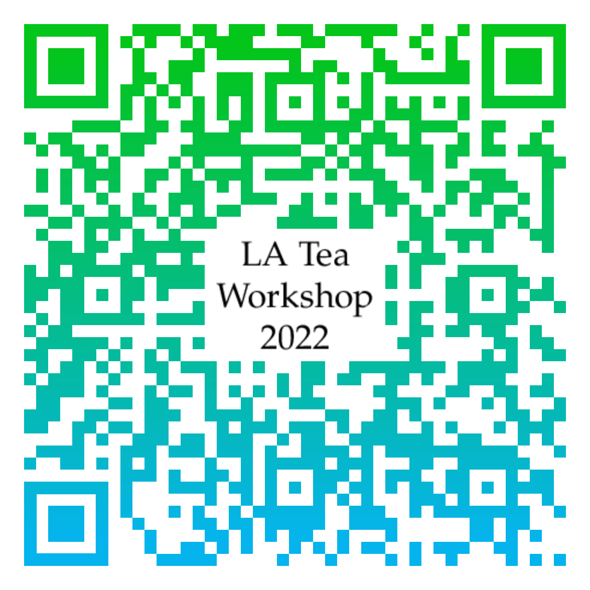

## 說明

數學訓練的本質不在於學會它的技術，而在於培養自己對各種概念的敏銳度、以及學會用不同面向來看問題。
只要邏輯上正確，每個人對數學模型的理解都可以是獨一無二的；而這也是數學美麗的地方。
LA Tea 工作坊的目標是提供適合大學生聽的演講，同時也鼓勵學生分享自己的看法。
五場為大學生設計的演講、搭配學長姊的經驗分享（研究所、出國讀書、找工作等），讓你在努力的路上有人結伴同行。
欲報從速，歡迎 [點此報名](https://docs.google.com/forms/d/e/1FAIpQLScp3kk-43DeE0gy5NxyMzU1mNHhKGo83f4J56TcM9qMMVNhrA/viewform?usp=sf_link){:target="_blank"}。

如果你喜愛線性代數、或是樂於分享自己的想法，[LA Tea 讀書會](../#la-tea-%E8%AE%80%E6%9B%B8%E6%9C%83) 全年招募新血；下一次的講者很有可能就是你！

## 活動資訊

- 時間：2/26（六）, 2022
- 地點：國立中山大學 理學院 SC4009-1
- 對象：主要為大學生，但歡迎所有人參加。
- 報名網址：[請點此報名](https://docs.google.com/forms/d/e/1FAIpQLScp3kk-43DeE0gy5NxyMzU1mNHhKGo83f4J56TcM9qMMVNhrA/viewform?usp=sf_link){:target="_blank"}。

## 活動流程

**每場演講均為 20 分鐘，結束後有 10 分鐘的討論、休息時間**

- 1:00報到、茶會
- 1:20開幕
- 1:30**講者：許峻彥**  
    

    講題：在二次形中求極值 &mdash; Rayleigh quotient
    

    

    大綱、參考資料
    

    
在這次的演講當中，我們會講解什麼是 <strong>Rayleigh quotient</strong>。Rayleigh quotient 是一種推斷特徵值範圍，或者尋找特徵值的一種方法。在這次的演講當中，我會一步步的帶大家了解它是如何運作，並且學會如何使用它。接著還會講到一些有關於 Rayleigh quotient 的應用。

    

- 2:00**講者：李翊誠**  
    

    講題：迭代法求特徵值 &mdash; power method
    

    

    大綱、參考資料
    

    
<strong>Power Method</strong> 是一種尋找矩陣特徵向量的方法，在這次的分享中我會提到它的運作方式，並且證明它的原理。再來我們會分析一下它的優缺點，以及除了 Power Method 以外還有那些常見的尋找特徵向量的演算法。

    
之後會和大家探討為何我們需要設計方法去找特徵向量，它有什麼應用？最後再點出 Google 搜尋背後的 <strong>PageRank Algorithm</strong> 和「尋找特徵向量」之間的關連性，希望同學們能夠理解到之中的原理。

    

- 2:30**講者：林其璜**
    

    講題：空間中必有垂直基底 &mdash; QR decomposition  
    

    

    大綱、參考資料
    

    
$QR$ 分解是一種矩陣分解方法，能夠將任意矩陣 $A$ 分解成一個正交矩陣 $Q$ 與一個上三角矩陣 $R$ 之積，透過觀察 $Q$ 與 $R$ 矩陣，我們能夠快速的了解原矩陣 $A$ 的行空間所具有的一些性質。

    
求解 $QR$ 分解有許多方法，其中利用 <strong>Gram&ndash;Schmidt 正交化</strong> 進行求解是我認為最直觀且最具幾何意義的方法，本次演講旨在利用簡單易懂的方式講解 Gram&ndash;Schmidt 正交化，並期待同學在理解此方法後能夠對 $QR$ 分解產生直觀的了解。

    
參考資料

    <ol>
    <li><a href="https://zh.wikipedia.org/wiki/QR%E5%88%86%E8%A7%A3">QR分解 - 維基百科</a></li>
    <li><a href="https://www.itread01.com/content/1544879282.html">淺談矩陣分解以及應用 - IT閱讀</a></li>
    </ol>
    

    

- 3:00**講者：朱立民**
    

    講題：對角化的應用
    

    

    大綱、參考資料
    

    
對角化，一開始動機在於讓一個可對角的矩陣可以和對角矩陣相似，那到底對角化可以做什麼？我們這次會討論它的應用。過程中我們會學到如何表示一個數學常數的次方為矩陣，例：$e^A$。也學會如何利用對角化解微分方程的問題。最後利用對角化將複雜的二次曲線在新的基底下表示成簡單的二次多項式，也就是將 $xy$ 項消掉。

    

- 3:30**講者：陳泯儒**  
    

    講題：在不可逆的矩陣上求反矩陣 &mdash; pseudoinverse
    

    

    大綱、參考資料
    

    
本次演講介紹偽逆矩陣（pseudoinverse）的概念。令 $A$ 為一個 $m\times n$ 矩陣，我們考慮線性函數 $f:\mathbb{R}^n\rightarrow\mathbb{R}^m$，其中 $f(\mathbf{x})=A\mathbf{x}$。我們知道 $A$ 可逆若且唯若 $f$ 可逆。然而，我們可以將 $f$ 的定義域和對應域分別限制在 $A$ 的列空間和行空間。在這樣的限制下，$f$ 必定是一個對射函數。因此我們可以定義線性函數 $f^\dagger:\mathbb{R}^m\rightarrow\mathbb{R}^n$，其中 $f^\dagger$ 在 $A$ 的行空間上為 $f$ 的反函數，而 $f^\dagger$ 在 $A$ 的左零空間上則為零函數。而 $A$ 的偽逆矩陣為 $f^\dagger$ 在標準基底下的矩陣表示法。

    

- 4:00**經驗分享座談**（30 分鐘團體座談、30 分鐘分組座談）  

| 座談 \ 主題 | 數學   | 統計   | 資工   | 出國讀書 |
|----------:|:-----:|:-----:|:-----:|:-----:|
|           | [相關資訊](https://docs.google.com/document/d/1rQjXbWgd8zjA_fUPl6LsfVK48jNKmo1TK-XG9N1ZI0k/edit?usp=sharing) | [相關資訊](https://hackmd.io/sF_ql8AtRNOZYwqMONLSSQ?view) | [相關資訊](https://docs.google.com/document/d/1eUwn7WT-8LZOWpUEKodYxt2qAVxdPmMRx_HsF0BZjVE/edit?usp=sharing) | [相關資訊](https://docs.google.com/document/d/135tBIzsfg4toR9SSuYjZ8e4c-2Y9tW0_Zx0r5Rhjvz8/edit?usp=sharing) |
| 團體座談   | 陳泯儒 | 徐浩雲 | 林其璜 | 林崇文 |
| 分組座談   | 許峻彥 | 洪卉芬 | 朱立民 |       |
|           |       |       | 李翊誠 |       |

如對活動有任何疑問，歡迎利用 `jephianlin [at] gmail [dot] com` 與 Jephian Lin  聯絡 :smiley: