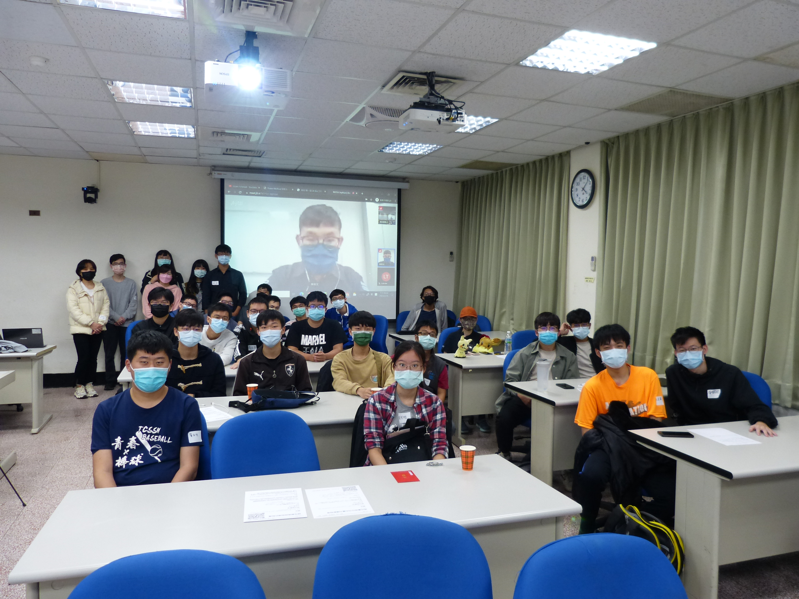
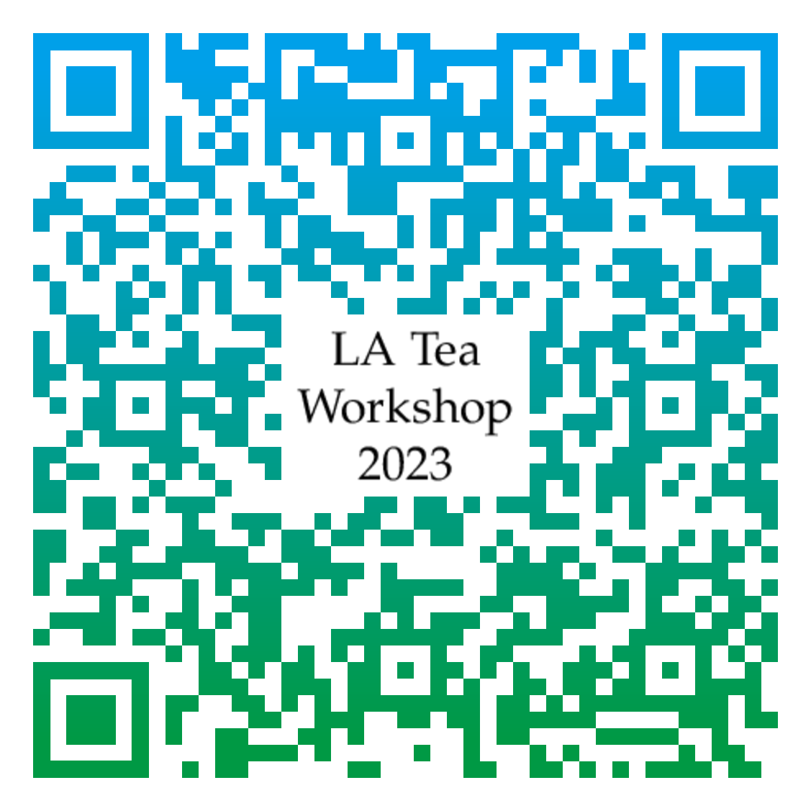

<!-- after -->
<!--

<h2 style="text-align: center"><a href="https://photos.app.goo.gl/QN12oW3W81QA79Fz5">活動花絮</a></h2>
-->

網站二維條碼

## 說明

數學訓練的本質不在於學會它的技術，而在於培養自己對各種概念的敏銳度、以及學會用不同面向來看問題。
只要邏輯上正確，每個人對數學模型的理解都可以是獨一無二的；而這也是數學美麗的地方。
LA Tea 工作坊的目標是提供適合大學生聽的演講，同時也鼓勵學生分享自己的看法。
五場為大學生設計的演講、搭配學長姊的經驗分享（研究所、出國讀書、找工作等），讓你在努力的路上有人結伴同行。
欲報從速，歡迎 [點此報名](https://docs.google.com/forms/d/e/1FAIpQLSd9PSF1aBP2t77BOOeHRCeUFSLXaskywGt0yuvZq43hq7UpOw/viewform?usp=sf_link){:target="_blank"}。

如果你喜愛線性代數、或是樂於分享自己的想法，[LA Tea 讀書會](../#la-tea-%E8%AE%80%E6%9B%B8%E6%9C%83) 全年招募新血；下一次的講者很有可能就是你！

## 活動資訊

- 時間：4/15（六）, 2023
- 地點：國立中山大學 理學院 SC4009-1
- 對象：主要為大學生，但歡迎所有人參加。
- 報名網址：[請點此報名](https://docs.google.com/forms/d/e/1FAIpQLSd9PSF1aBP2t77BOOeHRCeUFSLXaskywGt0yuvZq43hq7UpOw/viewform?usp=sf_link){:target="_blank"}。

## 活動流程

**每場演講均為 20 分鐘，結束後有 10 分鐘的討論、休息時間**

<!--
詳細議程待更新
-->

<!-- after -->
<!--
[演講、座談影片](https://youtube.com/playlist?list=PLjjwN6s_CKYngA_GpXQAF2spL5vRThaC9)
-->

- 1:00報到、茶會
- 1:20開幕
- 1:30**講者：劉芹榕**
    

    講題：Perron&ndash;Frobenius 定理
    

    

    大綱、參考資料
    

    
此定理主要敘述：若矩陣 $T$ 為非負、不可約（irreducible）矩陣，則必有一絕對值最大的的特徵值為正實數，此特徵值具有一些良好的性質，例如：此一特徵值有各項皆正的特徵向量與其對應、此特徵值的代數重數及幾何重數皆為 $1$ 等等。在這次演講中我將逐一介紹，並詳細講解定理的證明，過程中會用到一點分析的性質。

    

- 2:00**講者：葉覺文**   
    

    講題：一種方法判斷正定
    

    

    大綱、參考資料
    

    
令 $A$ 為一對稱矩陣。如果對於任意的非零向量 $\bv$ 都有 $\bv\trans A\bv > 0$，則稱 $A$ 為正定矩陣。但是用這種方式來做驗證一矩陣是否為正定矩陣十分費力，如果令 $A_k$ 為 $A$ 的前 $k$ 列和行所導出的子矩陣，則正定矩陣的另一個等價敘述為每一個 $k = 1,\ldots, n$ 都有 $\det(A_k) > 0$。所以矩陣的正定性可以用主子式的方式來做驗證，但是這個等價敘述不顯然，我們將用柯西交錯定理將其證出。

    

- 2:30**講者：杜惟翔**
    

    講題：如何在歐氏空間中實現點與點之間的距離
    

    

    大綱、參考資料
    

    
TBA

    

    

- 3:00**講者：張笛**
    

    講題：Householder 矩陣及其應用
    

    

    大綱、參考資料
    

    
Householder 矩陣為形如 $H=I-2\bu{\bu}\trans$ 的矩陣，其中 $\|\bu\|_2 = 1$。本次演講將從 Householder 矩陣的性質講起，並希望通過其幾何意義讓同學們對 Householder 矩陣有一個直觀的了解。最後將以一個簡單的例子來展示 Householder 矩陣如何應用在求解矩陣的 $QR$ 分解。

    

- 3:30**經驗分享座談**（30 分鐘團體座談、30 分鐘分組座談）  

| 座談 \ 主題 | 統計   | 資工   | 出國讀書 |
|----------:|:-----:|:-----:|:-----:|
|           | [相關資訊](https://docs.google.com/document/d/1KxJ5mqCGf0mQpC4-kQazVHRygEGVoBpXP2HjMWjaqHc/edit?usp=sharing) | [相關資訊](https://docs.google.com/document/d/1Nem1kaEOlGplAgQBK4lCzkuL92oqSkv99oXfUI4_Uew/edit?usp=sharing) | [相關資訊](https://docs.google.com/document/d/1VZBh_c_V52VN5OX1ty0MkVdKKV3J0h6ZbbUiPLjxvks/edit?usp=sharing) |
| 團體座談   | 高念慈 | 顏紫砡 | 顏廷維 |
| 分組座談   | 李昀樵 |       |       |
|           |       |       |       |

如對活動有任何疑問，歡迎利用 `jephianlin [at] gmail [dot] com` 與 Jephian Lin  聯絡 :smiley: