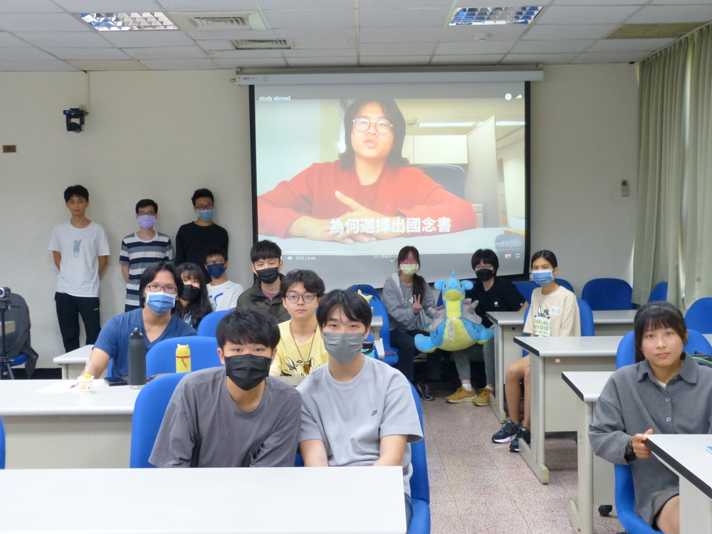
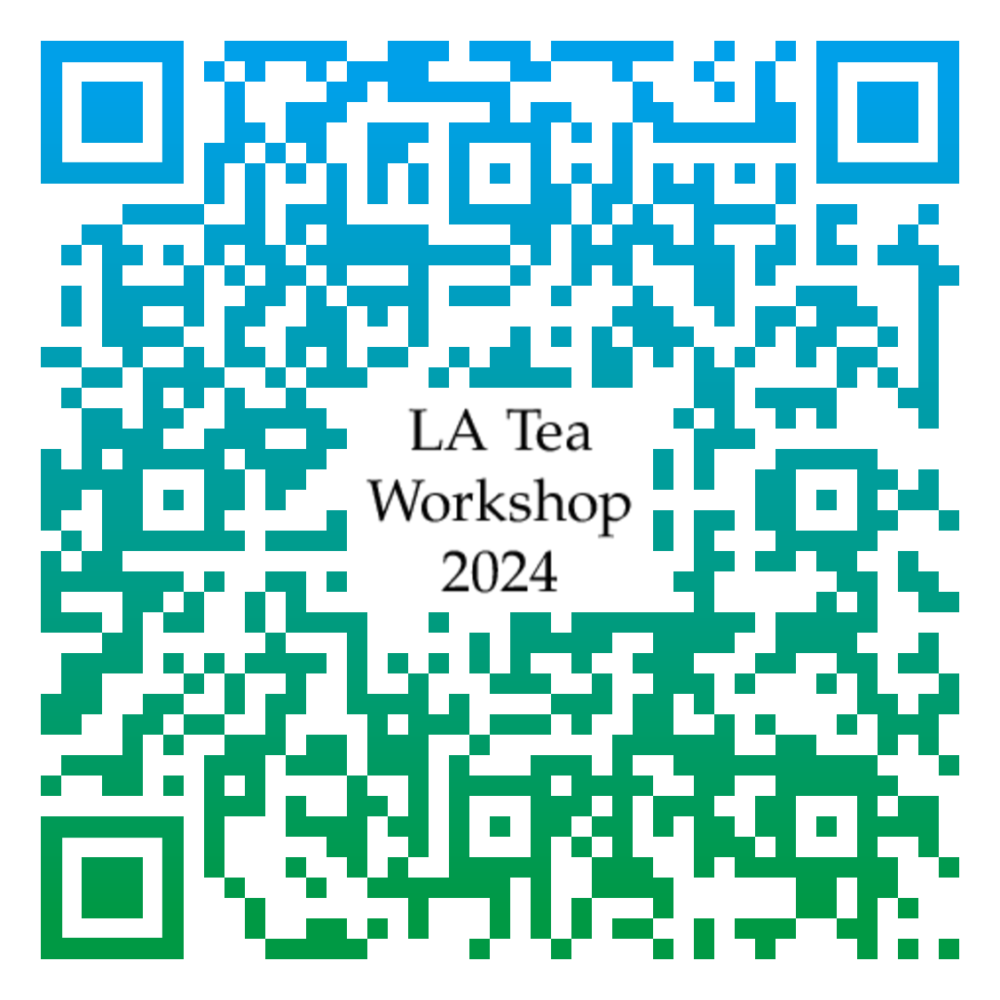

<!-- after 

  

<h2 style="text-align: center"><a href="https://photos.app.goo.gl/TqcPkyyCtaFmuJkT6">活動花絮</a></h2>
-->

網站二維條碼

## 說明

數學訓練的本質不在於學會它的技術，而在於培養自己對各種概念的敏銳度、以及學會用不同面向來看問題。
只要邏輯上正確，每個人對數學模型的理解都可以是獨一無二的；而這也是數學美麗的地方。
LA Tea 工作坊的目標是提供適合大學生聽的演講，同時也鼓勵學生分享自己的看法。
五場為大學生設計的演講、搭配學長姊的經驗分享（研究所、出國讀書、找工作等），讓你在努力的路上有人結伴同行。
欲報從速，歡迎 [點此報名](https://docs.google.com/forms/d/e/1FAIpQLSfozPdZfIWAX68skeKFdrP4QecxqVm1-4nFz07kY0OoXXjLjw/viewform?usp=sf_link){:target="_blank"}。

如果你喜愛線性代數、或是樂於分享自己的想法，[LA Tea 讀書會](../#la-tea-%E8%AE%80%E6%9B%B8%E6%9C%83) 全年招募新血；下一次的講者很有可能就是你！

## 活動資訊

- 時間：5/4（六）, 2024
- 地點：國立中山大學 理學院 SC4009-1
- 對象：主要為大學生，但歡迎所有人參加。
- 報名網址：[請點此報名](https://docs.google.com/forms/d/e/1FAIpQLSfozPdZfIWAX68skeKFdrP4QecxqVm1-4nFz07kY0OoXXjLjw/viewform?usp=sf_link){:target="_blank"}。

## 活動流程

**每場演講均為 20 分鐘，結束後有 10 分鐘的討論、休息時間**

<!--
詳細議程待更新
-->

<!-- after 
[演講、座談影片](https://youtube.com/playlist?list=PLjjwN6s_CKYmb8ZoQCITqfvcls1P1e3o7)
-->

- 1:00報到、茶會
- 1:20開幕
- 1:30**講者：陳芃穎**
    

    講題：二元線性分類演算法 &mdash; Perceptron Learning Algorithm
    

    

    大綱、參考資料
    

    
生活中總有一些事情答案不是 Yes 就是 No，例如要不要買早餐、會不會被教授當或是會不會被公司錄取等。如果這些問題可以用機器學習或是演算法幫你快速決定，那 PLA 就是這項工具！利用訓練 Perceptron 來尋找最完美的權重以做出二元的線性分類。我們將用線性代數的觀點來為 PLA 做一個簡單的介紹。

    

    

- 2:00**講者：張書鳴**
    

    講題：高斯消去法在電腦上的實現及誤差處理方法
    

    

    大綱、參考資料
    

    
高斯消去法是解決線性方程組的常用方法之一。在電腦上實現這個方法需要轉換數學步驟成為可計算的算法。然而，計算機浮點運算可能導致誤差。為處理誤差，我們可以使用 Scale Partial Pivoting 和 Partial Pivoting 兩種方法。前者通過縮放係數矩陣的行來降低誤差，後者則在每步選擇最大的主元素以減少除零錯誤。這兩種方法有助於提高計算準確性，確保高斯消去法在電腦上的應用。

    

    

- 2:30**講者：TBA**
    

    講題：TBA
    

    

    大綱、參考資料
    

    
TBA

    

    

- 3:00**經驗分享座談**（30 分鐘團體座談、30 分鐘分組座談）
- 4:00閉幕
    

    <a href="https://docs.google.com/forms/d/e/1FAIpQLSeEd2TDXzfMT15zSkOEb841BS8iyQiQ4FvmqJztZwWqkgG-AA/viewform?usp=sf_link">2024 LA Tea 意見回饋單</a>
    

| 座談 \ 主題 | 轉學   | 自主學習 | 統計   | 財經   | 數教/科教 |
|----------:|:-----:|:-----:|:-----:|:-----:|:-----:|
|           | [相關資訊]() | [相關資訊]() | [相關資訊]() | [相關資訊]() | [相關資訊](https://docs.google.com/document/d/1nN1uIKPcUnljkAmKchdpPsD1uffSZ5--m-KPBs8IAc0/edit?usp=sharing) |
| 團體座談    | 張書鳴   | TBA   | TBA   | TBA   |       |
| 分組座談    |       |       |       |       |       |
| 資訊分享    |       |       |       |       | :smiley: |

如對活動有任何疑問，歡迎利用 `jephianlin [at] gmail [dot] com` 與 Jephian Lin  聯絡 :smiley: