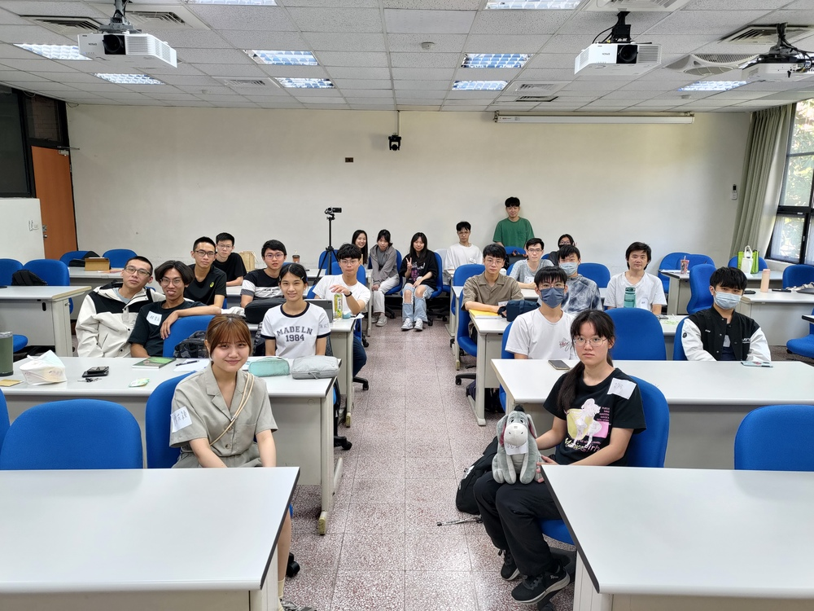

<!-- after 
-->

  

<h2 style="text-align: center"><a href="https://photos.app.goo.gl/jvMoMnMGjyxs3Fsf6">活動花絮</a></h2>

網站二維條碼

## 說明

數學訓練的本質不在於學會它的技術，而在於培養自己對各種概念的敏銳度、以及學會用不同面向來看問題。
只要邏輯上正確，每個人對數學模型的理解都可以是獨一無二的；而這也是數學美麗的地方。
LA Tea 工作坊的目標是提供適合大學生聽的演講，同時也鼓勵學生分享自己的看法。
五場為大學生設計的演講、搭配學長姊的經驗分享（研究所、出國讀書、找工作等），讓你在努力的路上有人結伴同行。
欲報從速，歡迎 [點此報名](https://docs.google.com/forms/d/e/1FAIpQLSfozPdZfIWAX68skeKFdrP4QecxqVm1-4nFz07kY0OoXXjLjw/viewform?usp=sf_link){:target="_blank"}。

如果你喜愛線性代數、或是樂於分享自己的想法，[LA Tea 讀書會](../#la-tea-%E8%AE%80%E6%9B%B8%E6%9C%83) 全年招募新血；下一次的講者很有可能就是你！

## 活動資訊

- 時間：5/4（六）, 2024
- 地點：國立中山大學 理學院 SC4009-1
- 對象：主要為大學生，但歡迎所有人參加。
- 報名網址：[請點此報名](https://docs.google.com/forms/d/e/1FAIpQLSfozPdZfIWAX68skeKFdrP4QecxqVm1-4nFz07kY0OoXXjLjw/viewform?usp=sf_link){:target="_blank"}。

## 活動流程

**每場演講均為 20 分鐘，結束後有 10 分鐘的討論、休息時間**

<!--
詳細議程待更新
-->

<!-- after 
[演講、座談影片](https://youtube.com/playlist?list=PLjjwN6s_CKYmb8ZoQCITqfvcls1P1e3o7)
-->

- 1:00報到、茶會
- 1:20開幕
- 1:30**講者：陳芃穎**
    

    講題：二元線性分類演算法 &mdash; Perceptron Learning Algorithm
    

    

    大綱、參考資料
    

    
生活中總有一些事情答案不是 Yes 就是 No，例如要不要買早餐、會不會被教授當或是會不會被公司錄取等。如果這些問題可以用機器學習或是演算法幫你快速決定，那 PLA 就是這項工具！利用訓練 Perceptron 來尋找最完美的權重以做出二元的線性分類。我們將用線性代數的觀點來為 PLA 做一個簡單的介紹。

    

    

- 2:00**講者：張書鳴**
    

    講題：高斯消去法在電腦上的實現及誤差處理方法
    

    

    大綱、參考資料
    

    
高斯消去法是解決線性方程組的常用方法之一。在電腦上實現這個方法需要轉換數學步驟成為可計算的算法。然而，計算機浮點運算可能導致誤差。為處理誤差，我們可以使用 Scale Partial Pivoting 和 Partial Pivoting 兩種方法。前者通過縮放係數矩陣的行來降低誤差，後者則在每步選擇最大的主元素以減少除零錯誤。這兩種方法有助於提高計算準確性，確保高斯消去法在電腦上的應用。

    

    

- 2:30**講者：劉芹榕**
    

    講題：一個在集合上的二元運算，會不會有結合律？
    

    

    大綱、參考資料
    

    
考慮一個集合 $X$ 以及其上的一個二元運算 $\odot: X\times X \rightarrow X$，如果對於任何 $X$ 中的元素 $a,b,c$ 都有 $(a \odot b) \odot c = a \odot (b \odot c)$ 的性質，則我們說 $\odot$ 具有結合律。要判斷是否有結合律最麻煩也最簡單的方法就是一組一組的去檢視，當 $|X| = n$ 時，因為要任取 $3$ 個元素檢測，這樣的演算法需要 $O(n^3)$ 的時間；但事實上我們可以透過數學方法找出更有效率的演算法可以節省時間，只是需要冒點機率上的風險，而這風險是我們所能掌握的。主要結果如下：把一個 $n$ 個元素的集合與一個二元運算的表格送進此演算法，每次執行這個程式最多只要 $O(n^2)$ 的時間，其結果會以 yes 或 no 呈現。如果二元運算有結合律，結果只會是 yes；如果沒有結合律，則 yes 為結果的機率最多只有 $\frac{1}{2}$。就讓我們用簡單的線性代數技巧來看看這演算法長什麼樣子。

    

    

- 3:00**經驗分享座談**（30 分鐘團體座談、30 分鐘分組座談）
- 4:00閉幕
    

    <a href="https://docs.google.com/forms/d/e/1FAIpQLSeEd2TDXzfMT15zSkOEb841BS8iyQiQ4FvmqJztZwWqkgG-AA/viewform?usp=sf_link">2024 LA Tea 意見回饋單</a>
    

| 座談 \ 主題 | 轉學   | 自主學習 | 數學   | 統計   | 財經   | 數教/科教 |
|----------:|:-----:|:-----:|:-----:|:-----:|:-----:|
|           | [相關資訊](https://docs.google.com/document/d/1RJqKCY9tV-Iqszlslzemt-osDV1hLBfbSoWsspJBDgI/edit?usp=sharing) | [相關資訊](https://docs.google.com/document/d/1YQJPypD9a-4h1yEL8YWK3k_fFy1kht1NaAq7Ja9aqUE/edit?usp=sharing) | [相關資訊](https://docs.google.com/document/d/1IXPlAgq44auxbuJ7m_FUPB3TdDsEoyZQAQfEnlksSt4/edit?usp=sharing) | [相關資訊](https://docs.google.com/document/d/18MAmnUmbHCP3aF9uuiohWR6dWujycHQNQC7nx2Ek5Dw/edit?usp=sharing) | [相關資訊](https://docs.google.com/document/d/1oPaVSivwZeMjTBzP2C9kjKGoyIWWZKgFPu_blH20kHg/edit?usp=sharing) | [相關資訊](https://docs.google.com/document/d/1nN1uIKPcUnljkAmKchdpPsD1uffSZ5--m-KPBs8IAc0/edit?usp=sharing) |
| 團體座談    | 張書鳴 | 傅冠文 |       |       |       |       |
| 分組座談    |       | 張亭瑄 |       |       |       |       |
| 資訊分享    |       |       | 黃銘宏 | 羅景耀 | 鄭志佑 | :smiley: |

如對活動有任何疑問，歡迎利用 `jephianlin [at] gmail [dot] com` 與 Jephian Lin  聯絡 :smiley: