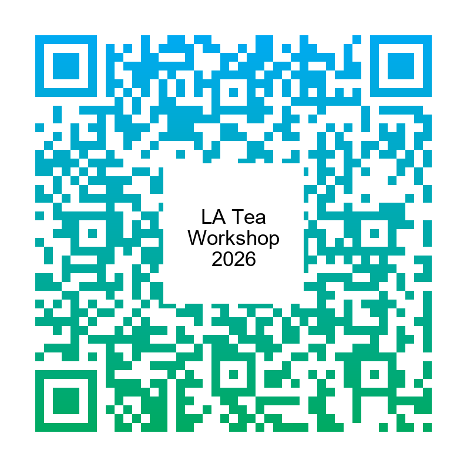

  

<h2 style="text-align: center"><a href=" https://photos.app.goo.gl/8xM5hBC8u3vdS71a6">活動花絮</a></h2>

網站二維條碼

## 活動資訊

- 時間：2026/8/17（一）  
- 地點：國立陽明交通大學 理學院 SA307

## 活動流程

- 10:00**講者：劉家安**
    

    講題：TBA
    

    

    大綱、參考資料
    

    
（大綱待更新...）

    

    

- 11:00**講者：鄭硯仁**
    

    講題：TBA
    

    

    大綱、參考資料
    

    
（大綱待更新...）

    

    

- 12:00**午餐自理**

- 2:00**講者：林晉宏**
    

    講題：Laplacian matrices and related problems
    

    

    大綱、參考資料
    

    
In this talk, we will give an introduction to classical results of the Laplacian matrix of a graph, including the matrix tree theorem, the algebraic connectivity, and the characteristic set.  Afterward, we discuss their recent developments and related problems.

    

    

- 3:00**講者：梁順維**
    

    講題：圖的絕對重心
    

    

    大綱、參考資料
    

    
Miroslav Fiedler在1989年提出的論文”Absolute Algebraic Connectivity of Trees”中為了決定樹的絕對代數連通度提出了圖的絕對重心（The Absolute Center of Gravity of Graph)，並且將其應用於樹上 。
      在這次報告中將介紹絕對重心的定義與在樹上如何決定其位置的相關定理；在樹上除了絕對重心外還有與其相似的樹的重心（The Centroid of tree)演算法也會一併介紹，並且比較兩種方法所得出的重心位置。

    

    

- 3:30**講者：徐振翔**
    

    講題：Graph Laplacians,Nodal Domains (節點域)
    

    

    大綱、參考資料
    

    
每一張簡單圖都能對應到一個拉普拉斯矩陣；若根據需求賦予邊不同的權重，我們將得到一個『一般化拉普拉斯矩陣』。透過求解該矩陣的特徵向量，我們能依據數值的正、負與零點，將原圖分割成數個獨立的區塊（即節點域）。本次報告將深入探討這類分割數量的理論上限，及其在譜圖理論中的實際應用。

    

    

- 4:00**講者：丁逸弘**
    

    講題：TBA
    

    

    大綱、參考資料
    

    
（大綱待更新...）

    

    

如對活動有任何疑問，歡迎利用 `jephianlin [at] gmail [dot] com` 與 Jephian Lin 聯絡 :smiley:
